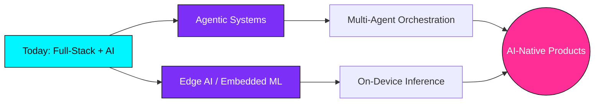

<!-- ╔══════════════════════════════════════════════════════════════════════════╗ -->
<!-- ║                    SATYANARAYANA · README.md · v2.0                       ║ -->
<!-- ╚══════════════════════════════════════════════════════════════════════════╝ -->
<div align="center">


</div>

<div align="center">


</div>


```
┌─[satya@dev]─[~/profile]
└──╼ $ ./boot.sh --verbose

[✔] Mounting neural cores .................... ONLINE
[✔] Loading model: LLM-Agent-v4 .............. READY
[✔] Compiling front-end pipeline ............. PASSED
[✔] Calibrating hardware interfaces .......... LINKED
[✔] Status .................................... SHIPPING 
```


<div align="center">
  
</div>

<div align="center">

[](https://github.com/satyaidk)
[](https://github.com/satyaidk)
[](https://github.com/satyaidk)

</div>

---

##  &nbsp;`whoami`

```python
from future import ambitions

class SatyaNarayana:
    """An engineer who treats every system — silicon or software — as solvable."""

    def __init__(self):
        self.name      = "Nikadi Satya Narayana"
        self.alias     = "satyaidk"
        self.location  = "India 🇮🇳"
        self.role      = "AI Engineer · Full-Stack Dev · Electronics Nerd"

        self.now       = ["Building AI agents", "Fine-tuning LLMs", "Robotics"]
        self.expertise = ["Front-End", "AWS & DevOps", "AI / ML", "Docker"]
        self.next      = ["Agentic workflows", "Edge AI on microcontrollers",
                          "RAG at scale"]

        self.contact   = "nikadisatyanarayana@gmail.com"
        self.mantra    = "First solve the problem. Then write the code."
        self.fun_fact  = "I debug hardware with the same energy I debug code 🔌"

    def philosophy(self) -> str:
        return "Ship fast, learn faster, and never fear the deep end."


me = SatyaNarayana()
print(me.philosophy())   # → "Ship fast, learn faster, and never fear the deep end."
```

---

## 🎯 &nbsp;What I'm Building Toward

<div align="center">

| 🧭 Focus | 🔧 What It Means | 🚀 Where It's Heading |
|:---|:---|:---|
| **🤖 AI Agents** | Autonomous systems that reason, plan & act | Multi-agent orchestration & tool use |
| **🧠 LLMs & RAG** | Retrieval-grounded, context-aware models | Production RAG, eval pipelines, fine-tuning |
| **🌐 Front-End** | Pixel-perfect, blazing-fast interfaces | AI-native UX & real-time apps |
| **☁️ Cloud / DevOps** | Containerized, reproducible deployments | CI/CD, IaC, scalable inference |
| **🔌 Electronics** | Hardware that talks to software | Edge AI, IoT, embedded ML |
| **🤝 Open Source** | Build in public, grow together | Maintaining & contributing upstream |

</div>

---

## 🛠️ &nbsp;Tech Arsenal

<div align="center">

#### ⚡ Languages
<p>
  
</p>

#### 🤖 AI / ML & Data
<p>
  
  
  
  
  
  
  
</p>

#### 🧩 Frameworks & Libraries
<p>
  
</p>

#### ☁️ Cloud & DevOps
<p>
  
</p>

#### 🗄️ Databases
<p>
  
</p>

#### 🎨 Design & Tools
<p>
  
</p>

</div>

---

## 📊 &nbsp;Activity & Stats

<div align="center">


</div>

<div align="center">


&nbsp;&nbsp;


</div>

<div align="center">


</div>

<div align="center">


</div>

---

## 🗺️ &nbsp;The Roadmap Ahead

<div align="center">



</div>

---

## 🌐 &nbsp;Let's Connect

<div align="center">

[](https://www.linkedin.com/in/nikadisatyanarayana)
[](https://twitter.com/@satya_idk)
[](https://instagram.com/0xsatya_idk)
[](mailto:nikadisatyanarayana@gmail.com)

</div>

---

<div align="center">

### 💡 Dev Quote of the Day


</div>

---

<div align="center">

```
╔══════════════════════════════════════════════════════════════╗
║   Thanks for visiting! Drop a ⭐ if something here sparked     ║
║   an idea — let's build the future, one commit at a time.     ║
╚══════════════════════════════════════════════════════════════╝
```


</div>

